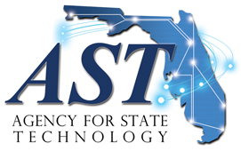

# Data Management Resources

Data management workgroup presentations, training topics, and resources.

Office of the Chief Data Officer:  https://www.ast.myflorida.com/chief-data-officer/

Data Management Association:  https://dama.org/

BrightTALK DAMA site.  Series of 10 free webinars: Functions of Data Management

https://www.brighttalk.com/channel/12405/dama
